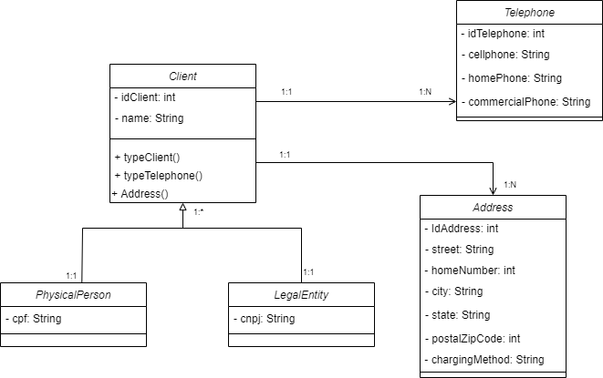
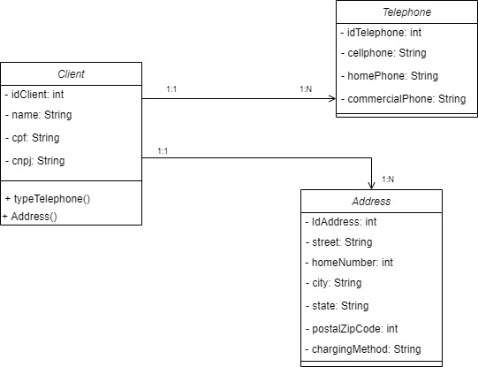

# OCTO Tecnologia
## Avaliação de Proficiência Tecnológica / Negócios

## Sobre
 &emsp;&emsp;Repositório dedicado ao desenvolvimento da Avaliação de Proficiência do processo seletivo da Octo Tecnologia.
 
&emsp;&emsp;A avaliação consiste em criar um CRUD para cadastro de clientes (pessoa física e/ou jurídica), conter lista de telefone celular, residencial ou comercial. Apresentar uma lista de endereço e sempre informar quando for conbrança, comercial, correspondência, entrega ou
residencial.

&emsp;&emsp;Apresentar na tela de listagem uma ordenação com paginação.
### Validação
1. Nome e documentos pessoais serão obrigatórios;
2. Deverá existir pelos menos um telefone e um endereço;
3. De acordo com o tipo de cliente, aplicar as máscaras necessário nos documentos pessoais; 

## Metodologia
&emsp;&emsp;O primeiro passo para a realização da avaliação foi buscar entender o problema, para facilitar a abstração foi desenhada uma primeira versão do sistema em diagrama de classe. 
Em seguida, foi iniciado os estudos da linguagem C# e o framework ASP.NET, assim como suas bibliotecas. Por conveniência do desenvolvedor, foi utlizado Code First para o desenvolvimento da aplicação.

## Diagrama de Classes
&emsp;&emsp;Como uma primeira versão do diagrama de classes, foi construído o seguinte diagrama.
### Versão 1.0

[Figura 1: Diagrama de classes v1](../../OCTO_CRUD/Assets/Octo_diagram_classe_V01.png)

&emsp;&emsp;Com o prazo da entrega se aproximando, foi tomada a decição de reeplanejar a estrutura do sistema na intenção de tornar o desenvolvimento menos complicado. Então, segue uma versão mais próxima do que foi desenvolvido no projeto.
### Versão 1.1

[Figura 1: Diagrama de classes v1](../../OCTO_CRUD/Assets/Octo_diagr_classe_V02.png)

## Tecnologias

- C#
- ASP.NET Core
- Sql Server (Express)
- Git

## Referências
- [Documentação do Entity Framework](https://docs.microsoft.com/pt-br/ef/)
- [Documentação do ASP.NET](https://docs.microsoft.com/pt-br/aspnet/core/?view=aspnetcore-5.0)
- [#02| CRUD em Asp.Net Core MVC | C#](https://www.youtube.com/watch?v=0HGvToWEItY)
